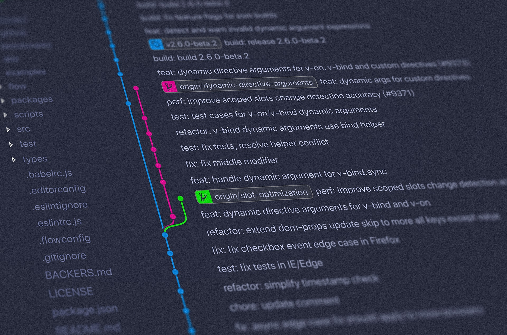

# gitTag

**gitTag** se trata de un programa construido en el lenguaje de programación _Python_, ideal para el generar versiones 
de GIT en proyectos (actualmente solo proyectos de PHP).

Actualmente, la herramienta cuenta con las siguientes utilidades:

* Obtener la versión del proyecto, generar el tag y subirlo a GIT.
* Eliminar la última versión del proyecto.

Mejoras a incorporar:

* Gestión de versiones para diferentes tipos de proyectos y no solo PHP.